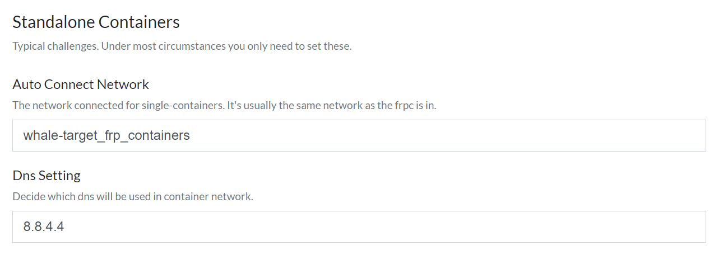
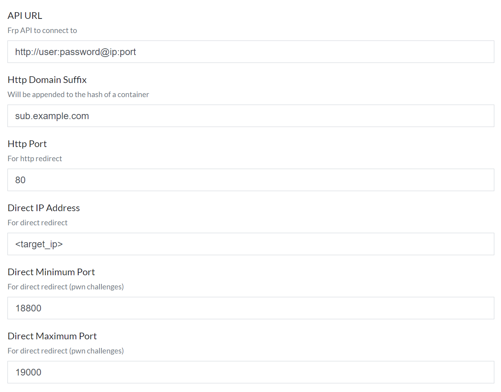

# Advanced deployment

## Note

Please make sure that you have experienced the installation process on single node. This deployment method is *NOT* recommended on first try. 

You'd better have some experience of docker and frp, too.

## Goal

The goal of this advanced deployment is to separate the CTFd web server and whale server for better docker instance performance.

For example, if you're in a school or an organization that has a number of high-powered dedicated server *BUT* no public IP address for public access, you can try to go through this tutorial and then modify on your condition.

## Architecture

In this tutorial, we have 2 separate VPS rent from a cloud provider. One has `1 core and 4G RAM`, the other has `4 cores and 8G RAM`, which we'll call them `web` and `target` server later.

Both server has its own public IPv4 address, but you can just have one -- depending on where your `frps` service is hosted.

This picture shows a brief glance.


---

## Step 1: Secure your docker API with TLS

### Operate on `target` server. 

*root user is recommended*

#### Enable docker swarm

```bash
$ docker swarm init
$ docker node update --label-add "name=linux-target-1" $(docker node ls -q)
```

Remember the label name, we'd use it later.

#### Clone the repo

```bash
$ git clone https://github.com/frankli0324/ctfd-whale
```

Please follow the [official document](https://docs.docker.com/engine/security/protect-access/#use-tls-https-to-protect-the-docker-daemon-socket) until you have executed the `chmod` command on `.pem` files, then continue reading this document

Now assume that you have generated your `.pem` certificates, and have changed privileges. Now you can tar your pem files to a single tar file

```bash
$ tar cf certs.tar *.pem
```

Modify your docker service configuration to enable TLS connection

```bash
$ cp /lib/systemd/system/docker.service /etc/systemd/system/docker.service
```

Change `line 13` from
```
ExecStart=/usr/bin/dockerd -H fd:// --containerd=/run/containerd/containerd.sock
```

to (multiple lines)

```
ExecStart=/usr/bin/dockerd --tlsverify \
--tlscacert=/etc/docker/certs/ca.pem \
--tlscert=/etc/docker/certs/server-cert.pem \
--tlskey=/etc/docker/certs/server-key.pem \
-H tcp://0.0.0.0:2376 \
-H unix:///var/run/docker.sock
```

Reload the docker daemon

```bash
$ systemctl daemon-reload
$ systemctl restart docker
```

**Remember, these keys are equal to root password on this server, protect it carefully**

### Operate on `web` server

Make a new directory in CTFd repo directory

```bash
$ cd CTFd
$ mkdir docker-certs
```

Copy the tar file we created earlier from `target` server. Sftp, whatever

```bash
$ tar xf certs.tar
```

Open `docker-compose.yml` of CTFd, add this line in the `volume` sector of `CTFd` service to make certs reachable by ctfd-whale. 

```
./docker-certs:/etc/docker/certs:ro
```

You may also delete **all** stuff related to `frp` like `frp_network`, since we don't need to run challenge instance on `web` server. But if you just has one public IP for `web` server, you can leave a single `frps` service running.

Then recreate your containers

```bash
$ docker-compose up -d
```

Now open your browser and go to whale configuration page, and apply arguments according to this example


Note:
- `API URL` must be like `https://<target_ip>:<port>` form
- `Swarm Node` name is the `label name` we set earlier when initialize docker swarm
- `SSL` stuff's path is those in `CTFd` container, which are `/etc/docker/certs/*` by default if you followed steps.

For standalone container challenges, 



`Auto Connect Network` is like `<directory_name>_<network_name>`, which is `whale-target_frp_containers` by default

For grouped container challenges, not tested

## Step2: Configure FRP

### Wildcard records

If you want `http` access method available, add a record in your DNS provider

It may be like 

```
*.example.com
*.sub.example.com (used for tutorial)
```

### Operate on `target` server

cd into `whale-target` directory and modify `frp` related configs

```bash
$ cd ctfd-whale/whale-target
$ cp frp/frps.ini.example frp/frps.ini
$ cp frp/frpc.ini.example frp/frpc.ini
```

Modify `frp/frps.ini`

- Change `token` to a random string, for example, [an UUID](https://www.uuidgenerator.net)
- Note that `vhost_http_port` is exposed to public, which should be the same in `whale-target/docker-compose.yml`.
- `subdomain_host` is the wildcard record we set earlier, but with no

Modify `frp.frpc.ini`

- Paste `token` from frps.ini
- Set `admin_user` and `admin_pwd` variable, for frpc's basic auth

### Oprate on `web` server

Open whale config page, apply according to this picture:



Note that:
- `API URL` should be link `http://user:password@ip:port` form, change variables on your condition
- `Http Domain Suffix` should be the same as `subdomain_host`, if you set `*.sub.example.com`, then it should be `sub.example.com`
- `Http Port` should be the same as `vhost_http_port` in `frps.ini`
- `Direct * Port` should be the same as ports in `whale-target/docker-compose.yml` that frps exposes
- Once the API configuration is done, `ctfd-whale` will acquire the `frpc.ini` automatically and make it a template

--- 

Now the advanced deployment should be done. You can add a challenge to test it out.

Be aware that `dynamic_docker` challenge can *not* be deleted, so make sure your fellow admins won't publish your test challenge when game starts.

You can use this command in whale-target directory

```bash
$ docker-compose logs
```

to print out logs, ctrl-c to exit